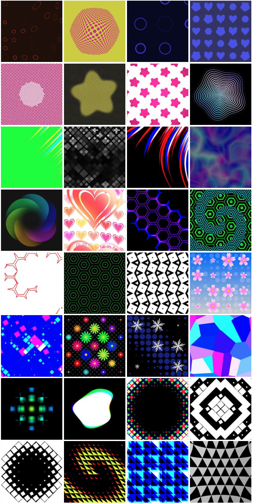

# Unity-ShaderSketches [](http://mit-license.org)

[https://setchi.jp/unity/shader-sketches/](https://setchi.jp/unity/shader-sketches/)



## Usage
- Clone repository
- Open and play the following scene
```
Assets/ShaderSketches/Showcase.unity
```

## Environment
Unity 2018.2.12f1

## License
MIT
